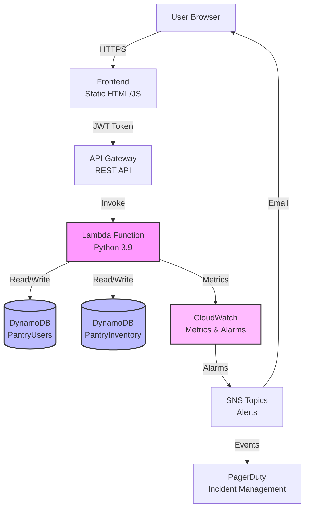

# Architecture Diagram

## System Architecture Overview

```
┌─────────────────────────────────────────────────────────────────┐
│                         User Browser                            │
│                    (Frontend - Static HTML/JS)                  │
└────────────────────────────┬────────────────────────────────────┘
                             │ HTTPS
                             │ JWT Token (Bearer)
                             ▼
┌─────────────────────────────────────────────────────────────────┐
│                      API Gateway (REST)                         │
│  - Routes: /auth/*, /inventory                                  │
│  - Authentication: JWT Bearer Token                             │
│  - CORS: Enabled                                                │
└────────────────────────────┬────────────────────────────────────┘
                             │
                             ▼
┌─────────────────────────────────────────────────────────────────┐
│                    Lambda Function                              │
│              (PantryInventoryFunction)                          │
│  - Runtime: Python 3.9                                          │
│  - Memory: 256 MB                                               │
│  - Timeout: 10s                                                 │
│  - Reserved Concurrency: 100                                    │
│  - Lambda Insights: Enabled                                     │
│                                                                 │
│  Handlers:                                                      │
│  ├─ POST /auth/signup  → signup()                               │
│  ├─ POST /auth/login   → login()                                │
│  ├─ GET  /inventory    → get_inventory()                        │
│  ├─ POST /inventory    → add_item()                             │
│  └─ DELETE /inventory  → remove_item()                          │
└────────────┬───────────────────────────────┬────────────────────┘
             │                               │
             │                               │
             ▼                               ▼
┌──────────────────────────┐    ┌──────────────────────────┐
│   DynamoDB: PantryUsers  │    │ DynamoDB: PantryInventory│
│                          │    │                          │
│  PK: username (String)   │    │  PK: householdId (String)│
│                          │    │  SK: itemId (String)     │
│  Attributes:             │    │                          │
│  - password (hashed)     │    │  Attributes:             │
│  - createdAt             │    │  - name                  │
│                          │    │  - quantity              │
│  Auto-scaling: N/A       │    │  - createdAt             │
│  (PAY_PER_REQUEST)       │    │                          │
│                          │    │  Auto-scaling:           │
│                          │    │  - Min: 5 RCU/WCU        │
│                          │    │  - Max: 100 RCU/WCU      │
│                          │    │  - Target: 70% util      │
└──────────────────────────┘    └──────────────────────────┘
```

## Monitoring & Observability Layer

```
┌─────────────────────────────────────────────────────────────────┐
│                    CloudWatch                                   │
│                                                                 │
│  Metrics:                                                       │
│  ├─ Lambda: Errors, Duration, Throttles, ConcurrentExecutions   │
│  ├─ DynamoDB: ThrottleEvents, CapacityUtilization               │
│  └─ API Gateway: 4XXError, 5XXError, Latency, Count             │
│                                                                 │
│  Alarms:                                                        │
│  ├─ LambdaErrors (> 5 in 2 min)                                 │
│  ├─ LambdaThrottles (> 0)                                       │
│  ├─ LambdaDuration (> 8s avg)                                   │
│  ├─ DynamoDBReadThrottles (> 0)                                 │
│  ├─ DynamoDBWriteThrottles (> 0)                                │
│  └─ API5xxErrors (> 5 in 2 min)                                 │
│                                                                 │
│  Logs:                                                          │
│  └─ /aws/lambda/PantryInventoryFunction                         │
│                                                                 │
│  Insights:                                                      │
│  └─ Lambda Insights Extension (Performance, Memory)             │
└────────────────────────────┬────────────────────────────────────┘
                             │
                             ▼
┌─────────────────────────────────────────────────────────────────┐
│                    SNS Topics                                   │
│                                                                 │
│  ├─ AlertTopic → Email Notifications                            │
│  └─ PagerDutyTopic → PagerDutyFunction → PagerDuty API          │
└─────────────────────────────────────────────────────────────────┘
```

## Data Flow

### Authentication Flow

```
User → Frontend → POST /auth/signup
                    │
                    ▼
              Lambda Function
                    │
                    ├─ Hash Password (SHA-256)
                    ├─ Store in PantryUsers table
                    └─ Generate JWT Token
                    │
                    ▼
              Return Token → Frontend → Store in localStorage
```

### Inventory Operation Flow

```
User → Frontend → API Gateway
                    │
                    ├─ Validate JWT Token
                    │
                    ▼
              Lambda Function
                    │
                    ├─ Verify Token
                    ├─ Extract username
                    │
                    ▼
              DynamoDB Operation
                    │
                    ├─ Query/Write PantryInventory
                    │  (householdId = username)
                    │
                    ▼
              Return Response → Frontend → Update UI
```

## Component Details

### Frontend
- **Technology**: Vanilla JavaScript, HTML, CSS
- **Hosting**: Static files (can be deployed to S3, Netlify, etc.)
- **Authentication**: JWT tokens stored in localStorage
- **API Communication**: Fetch API with Bearer token

### API Gateway
- **Type**: AWS API Gateway REST API
- **Authentication**: JWT Bearer token validation in Lambda
- **CORS**: Enabled for all origins
- **Rate Limiting**: Not configured (can be added)

### Lambda Function
- **Language**: Python 3.9
- **Handler**: `lambda_function.lambda_handler`
- **Dependencies**: boto3, PyJWT, cryptography
- **Environment Variables**:
  - `TABLE_NAME`: PantryInventory table name
  - `USERS_TABLE_NAME`: PantryUsers table name
  - `JWT_SECRET`: Secret for JWT signing

### DynamoDB Tables

#### PantryUsers
- **Partition Key**: `username` (String)
- **Attributes**: `password` (hashed), `createdAt`
- **Billing**: PAY_PER_REQUEST
- **Purpose**: User authentication

#### PantryInventory
- **Partition Key**: `householdId` (String) - equals username
- **Sort Key**: `itemId` (String)
- **Attributes**: `name`, `quantity`, `createdAt`
- **Billing**: PROVISIONED with auto-scaling
- **Purpose**: Store inventory items per user

## Security Boundaries

```
┌─────────────────────────────────────────────────────────────┐
│                    Public Internet                          │
└────────────────────────────┬────────────────────────────────┘
                             │
                             │ HTTPS Only
                             ▼
┌─────────────────────────────────────────────────────────────┐
│              Trust Boundary 1: API Gateway                  │
│  - Public endpoint                                          │
│  - No authentication at gateway level                       │
│  - CORS enabled                                             │
└────────────────────────────┬────────────────────────────────┘
                             │
                             │ IAM Role Authentication
                             ▼
┌─────────────────────────────────────────────────────────────┐
│              Trust Boundary 2: Lambda Function              │
│  - JWT token validation                                     │
│  - User authentication                                      │
│  - Request authorization                                    │
└────────────────────────────┬────────────────────────────────┘
                             │
                             │ IAM Policy (DynamoDBCrudPolicy)
                             ▼
┌─────────────────────────────────────────────────────────────┐
│              Trust Boundary 3: DynamoDB                     │
│  - IAM-based access control                                 │
│  - User data isolation (username = householdId)             │
│  - No cross-user data access                                │
└─────────────────────────────────────────────────────────────┘
```

## Scalability Features

### Auto-Scaling
- **DynamoDB**: Automatically scales 5-100 RCU/WCU based on 70% utilization
- **Lambda**: Automatically scales based on request volume (max 100 concurrent)

### Back-Pressure Mechanisms
- **Lambda Reserved Concurrency**: Limits to 100 concurrent executions
- **DynamoDB Max Capacity**: Limits to 100 RCU/WCU
- **Kill Switch**: Manual emergency capacity reduction

## Deployment Architecture

```
┌─────────────────────────────────────────────────────────────┐
│                    AWS Region: us-west-2                    │
│                                                             │
│  ┌──────────────────────────────────────────────────────┐   │
│  │         CloudFormation Stack                         │   │
│  │         (CloudPantryTracker)                         │   │
│  │                                                      │   │
│  │  Resources:                                          │   │
│  │  ├─ API Gateway (ServerlessRestApi)                  │   │
│  │  ├─ Lambda Function (PantryInventoryFunction)        │   │
│  │  ├─ Lambda Function (PagerDutyFunction)              │   │
│  │  ├─ DynamoDB Table (PantryInventory)                 │   │
│  │  ├─ DynamoDB Table (PantryUsers)                     │   │
│  │  ├─ SNS Topics (AlertTopic, PagerDutyTopic)          │   │
│  │  ├─ CloudWatch Alarms (6 alarms)                     │   │
│  │  └─ Auto-Scaling Policies (2 policies)               │   │
│  └──────────────────────────────────────────────────────┘   │
└─────────────────────────────────────────────────────────────┘
```

## Network Flow

```
Client (Browser)
    │
    │ HTTPS
    │
    ▼
API Gateway (AWS Managed)
    │
    │ Internal AWS Network
    │
    ▼
Lambda Function (VPC: Default)
    │
    │ AWS SDK (boto3)
    │
    ▼
DynamoDB (AWS Managed)
```

## Cost Model

### Idle State (Low Traffic)
- API Gateway: $0 (free tier)
- Lambda: $0 (free tier)
- DynamoDB: ~$2.34/month (5 RCU/WCU provisioned)
- CloudWatch: ~$1.20/month (metrics, alarms, logs)
- **Total**: ~$4/month

### Surge State (High Traffic)
- API Gateway: ~$7/month (2M requests)
- Lambda: ~$0.40/month (2M invocations)
- DynamoDB: ~$23.40/month (50 RCU/WCU average)
- CloudWatch: ~$6.50/month (increased metrics/logs)
- **Total**: ~$37.60/month

## High-Level Architecture (Mermaid)



## Component Interaction Sequence

### Signup Sequence

```
User          Frontend        API Gateway      Lambda         DynamoDB
  │              │                 │              │               │
  │--Signup----->│                 │              │               │
  │              │--POST /auth/signup------------>│               │
  │              │                 │              │               │
  │              │                 │              │--Hash Password│
  │              │                 │              │               │
  │              │                 │              │--Put Item---->│
  │              │                 │              │<---Success----│
  │              │                 │              │               │
  │              │                 │              │--Generate JWT │
  │              │                 │              │               │
  │              │<--200 + Token---│<--Response---│               │
  │<--Store Token│                 │              │               │
  │              │                 │              │               │
```

### Get Inventory Sequence

```
User          Frontend        API Gateway      Lambda         DynamoDB
  │              │                 │              │               │
  │--Get Items-->│                 │              │               │
  │              │---GET /inventory + Token------>│               │
  │              │                 │              │               │
  │              │                 │              │--Verify JWT---│
  │              │                 │              │               │
  │              │                 │              │---Query------>│
  │              │                 │              │<--Items-------│
  │              │                 │              │               │
  │              │<--200 + Items---│<--Response---│               │
  │<--Display----│                 │              │               │
  │              │                 │              │               │
```

